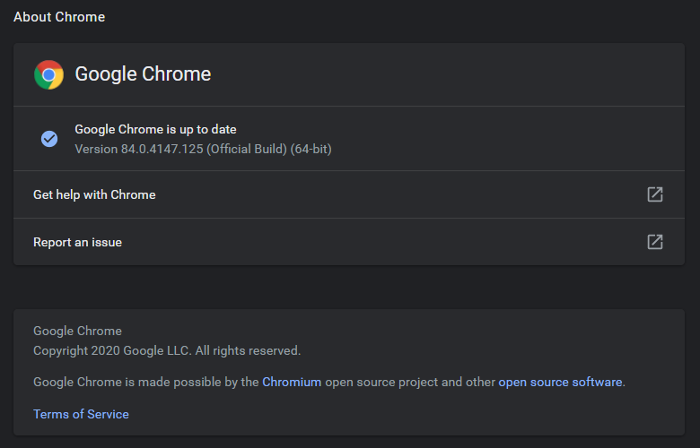

# The Typing Cat

theTypingCat automates the typing test on [theTypingCat.com](https://thetypingcat.com/) using [Selenium WebDriver](https://selenium-python.readthedocs.io/)

## Requirements

Install the Selenium library for python
```bash
python3 -m pip install selenium
```

Open chrome, goto `chrome://settings/help` and note down the chrome version   



Now download a compatible version of [Chrome Driver](https://chromedriver.chromium.org/downloads)  
My chrome version is 84.0 so I downloaded Chrome Driver 84.0

## Installation

Once you have installed Selenium and downloaded Chrome Driver, clone the git repository on your machine
```bash
git clone https://github.com/p0i5on8/theTypingCat.git
```

Now copy the Chrome Driver in this directory
```bash
cp ~/Downloads/chromedriver.exe theTypingCat
```

If you want to use Firefox then, download the [Gecko Driver](https://github.com/mozilla/geckodriver/releases) and place it in this directory 

## Usage

For 1 minute typing test (will use chrome without user sign in)
```bash
python3 theTypingCat.py -t 1
```

To use Firefox for 5 minutes typing test with user sign in
```bash
python3 theTypingCat.py -b firefox -t 5 -u <username>
```

## Demo

[](https://www.youtube.com/watch?v=H7EZ_vs_hpQ)
